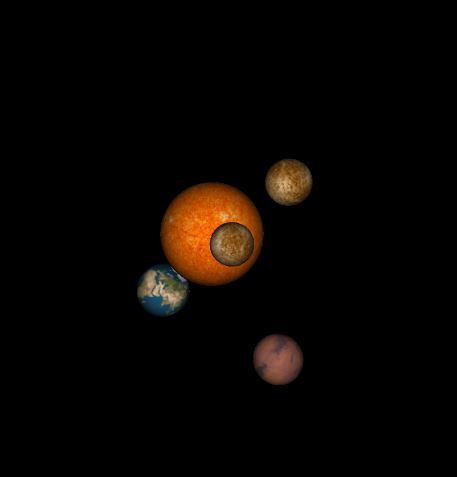
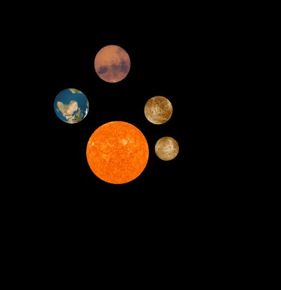

# Taller Shaders

## Objetivo

Estudiar la clase Shaders y su aplicación en la creación de objetos agregando efectos de luz y texturas.

## Descripción

En este taller se creo una simulación del sistema solar en el cual se tiene la fuente de luz que es el sol y los planetas giran al rededor de este. Con los número del 1 al 4 se puede cambiar el tipo de luz, difusa, specular y ambiete.
## Bibliografía

Para el monvimiento de los planetas y la forma del sistema se tomo como referencia el código del siguiente repositorio:
https://github.com/CodingTrain/website/tree/master/CodingChallenges/CC_008_SolarSystemGenerator3D

## Integrantes

| Integrante | github nick |
|------------|-------------|
| Tania Paola Hurtado | TaniaHurtado|

## Resultados

Como resultado se tiene imágenes del sistema solar con iluminación difusa:

     
     

     
   y con especular:
   
   

     
     

